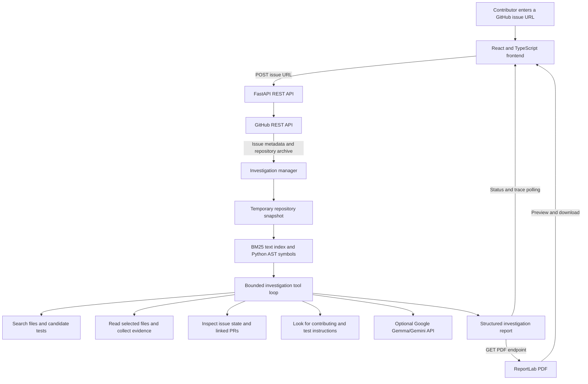

# RepoXray

**Investigate smarter. Contribute confidently.**

RepoXray helps contributors understand a public GitHub issue before they start changing code. Enter an issue URL to inspect issue metadata, search a repository snapshot for candidate implementation files and tests, check for selected signs of overlapping work, and review an evidence-based contribution roadmap. Completed investigations can be previewed and downloaded as PDF reports.

RepoXray is an investigation aid: it does not modify repositories, fix issues automatically, run a repository's tests, or guarantee that an issue is available to work on.

## Contents

- [Problem statement](#problem-statement)
- [Features](#features)
- [Screenshots](#screenshots)
- [How the investigation works](#how-the-investigation-works)
- [Technology stack](#technology-stack)
- [Project structure](#project-structure)
- [Prerequisites](#prerequisites)
- [Installation and setup](#installation-and-setup)
- [Environment configuration](#environment-configuration)
- [Run RepoXray](#run-repoxray)
- [Usage workflow](#usage-workflow)
- [API reference](#api-reference)
- [Testing](#testing)
- [Contributing](#contributing)
- [GitHub collaboration workflow](#github-collaboration-workflow)
- [Troubleshooting](#troubleshooting)
- [Known limitations](#known-limitations)
- [Future enhancements](#future-enhancements)
- [License](#license)

## Problem statement

When an issue is filed in an unfamiliar repository, a contributor has to discover where the behavior lives, which tests might cover it, whether maintainers or linked pull requests are already involved, and how the project expects changes to be checked. Searching manually takes time, while unsupported AI suggestions can point to files or tests that do not exist.

RepoXray gathers repository and issue evidence first, then presents candidate references and recommendations that can be checked against their source. It keeps candidate matches, file-read evidence, model inferences, warnings, and uncertainties distinguishable rather than presenting every suggestion as a verified fact.

## Features

- **GitHub issue intake:** accepts issue URLs in the form `https://github.com/owner/repository/issues/123`; pull-request URLs and malformed URLs are rejected.
- **Repository search:** downloads a repository snapshot, indexes up to the configured file and file-size limits, and ranks text matches with BM25. Python function, async-function, and class names are also extracted with the Python AST.
- **Candidate source files:** shows paths, reasons for selection, optional symbols and line ranges, evidence type, and GitHub source links when available.
- **Relevant test candidates:** searches indexed test files and shows why each is related. A candidate test is not evidence that the test was run.
- **Conflict signals:** reports issue state and assignee metadata, and looks for linked or cross-referenced pull requests. These checks cannot detect every unlinked or off-platform effort.
- **Contribution roadmap:** displays investigation recommendations in order, including suggested action types, target files, and documented test commands when found. The UI checkboxes are for the current view; roadmap progress is not persisted.
- **Investigation trace and status:** displays status, progress, and agent-tool results. The frontend polls the backend for updates; this is not a streaming/SSE connection.
- **Optional model assistance:** uses the configured Google Gemma/Gemini model integration when available. Without a model key, RepoXray uses a deterministic evidence-discovery sequence. Invalid or unavailable model actions also fall back to that sequence.
- **PDF preview and download:** creates a PDF from the completed investigation report, with issue details, executive summary, candidate files and tests, evidence links, conflict findings, roadmap, warnings, limitations, and uncertainties. Tests are explicitly presented as candidates, not executed test results.
- **Light and dark themes:** light mode is the default; the theme choice is stored in browser `localStorage`.
- **Local browser history:** completed investigation references are stored in browser `localStorage`. The corresponding report itself currently lives in backend memory.

## Screenshots

No screenshot files are currently included in the repository. Add screenshots here when they are checked into the project; this section intentionally does not embed external or untracked images.

## How the investigation works



1. The frontend submits the issue URL to the backend.
2. The backend validates the URL, retrieves issue metadata from GitHub, and downloads a repository archive into a temporary directory.
3. The indexer excludes common generated/dependency directories and binary file types, applies configured file-count and file-size limits, builds a BM25 index, and extracts Python symbols.
4. The agent runs up to `MAX_AGENT_STEPS` tool steps. Its tools search indexed code, read files, locate test candidates, check issue information and linked PRs, and read a contribution guide or README for commands.
5. Baseline evidence collection and report construction run even when model assistance is not configured. File recommendations are checked against the indexed snapshot before they are included.
6. The frontend polls status and trace endpoints while the investigation runs. Once the report is complete, it displays the evidence and roadmap.
7. The PDF endpoint renders that stored report. The frontend previews the returned PDF and offers a download.

### Evidence labels and interpretation

| Label | Meaning |
|---|---|
| `VERIFIED_FACT` | The investigation read the referenced file from the downloaded repository snapshot. This verifies the cited file content, not that it is the cause of the issue. |
| `HEURISTIC_MATCH` | A search or retrieval method found a potentially relevant file/test. Treat it as a candidate to inspect. |
| `AI_INFERENCE` | A model-generated interpretation or recommendation. Check it against the linked source and project behavior. |

GitHub links use the commit SHA available during issue metadata retrieval when available; otherwise the code may use the repository's `main` branch as the link reference. Confirm a link still matches the repository state you intend to work against.

## Technology stack

| Area | Technologies in this repository |
|---|---|
| Frontend | React 18, TypeScript, Vite, Tailwind CSS 4, Axios, Lucide React |
| Backend | Python, FastAPI, Uvicorn, Pydantic, `httpx` |
| Repository retrieval | `rank-bm25`, Python `ast` |
| Optional AI integration | Google Gemma/Gemini API |
| PDF generation | ReportLab |
| Backend tests | pytest, pytest-asyncio, FastAPI TestClient |

## Project structure

```text
.
├── README.md
├── LICENSE
├── backend/
│   ├── .env.example
│   ├── requirements.txt
│   ├── app/
│   │   ├── main.py                 # FastAPI app, CORS, router
│   │   ├── config.py               # Environment settings
│   │   ├── api/routes.py           # HTTP API routes
│   │   ├── models/schemas.py       # Request and report schemas
│   │   └── services/
│   │       ├── agent_service.py
│   │       ├── github_service.py
│   │       ├── indexer_service.py
│   │       ├── investigation_manager.py
│   │       ├── model_provider.py
│   │       └── pdf_report_service.py
│   └── tests/
├── frontend/
│   ├── .env.example
│   ├── package.json
│   ├── vite.config.ts
│   └── src/
│       ├── App.tsx
│       ├── index.css
│       ├── services/api.ts
│       ├── types/index.ts
│       └── components/
│           ├── Hero.tsx
│           ├── InvestigationWorkspace.tsx
│           ├── IssueInputForm.tsx
│           ├── IssueOverviewCard.tsx
│           ├── SummaryCard.tsx
│           ├── SourceFileCard.tsx
│           ├── TestExplorerCard.tsx
│           ├── ConflictAlertCard.tsx
│           ├── RoadmapCard.tsx
│           ├── AgentTraceCard.tsx
│           ├── Navbar.tsx
│           ├── Sidebar.tsx
│           ├── HistoryDrawer.tsx
│           ├── HowItWorksModal.tsx
│           └── ModelStatusModal.tsx
└── .gitignore
```

## Prerequisites

- Windows PowerShell (commands below use PowerShell syntax).
- Python **3.10 or later** and `pip`.
- Node.js **18 or later** and `npm`.
- Git, for obtaining the repository.
- Internet access for GitHub API and archive requests.
- Optional: a GitHub personal access token to increase GitHub API rate limits or access private repositories.
- Optional: a Google AI Studio/Gemini API key for model-assisted investigations. Heuristic evidence discovery works without it.

## Installation and setup

Clone the repository if you have not already:

```powershell
git clone https://github.com/manyamaan71/hacktoberfest.git
cd hacktoberfest
```

### 1. Configure the backend

From the repository root, create a local environment file from the tracked example:

```powershell
Copy-Item backend\.env.example backend\.env
```

Edit `backend\.env` with a text editor if you want to configure optional tokens. Never commit `.env` or paste secrets into issues or pull requests.

Create and install the Python environment:

```powershell
Set-Location backend
python -m venv venv
.\venv\Scripts\Activate.ps1
python -m pip install --upgrade pip
python -m pip install -r requirements.txt
```

If PowerShell prevents virtual-environment activation, either allow script activation according to your machine's policy or invoke the environment executables directly:

```powershell
.\venv\Scripts\python.exe -m pip install -r requirements.txt
.\venv\Scripts\python.exe -m pytest -v
```

### 2. Configure the frontend

Open a second PowerShell terminal at the repository root:

```powershell
Copy-Item frontend\.env.example frontend\.env
Set-Location frontend
npm ci
```

The example sets `VITE_API_BASE_URL=http://localhost:8000`, matching the local backend. Vite's development server also proxies `/api` to `127.0.0.1:8000`.

## Environment configuration

### Backend: `backend/.env`

`backend/.env.example` is the source of the available settings. The backend loads environment variables at startup; restart Uvicorn after changing them.

| Variable | Default in example/config | Purpose |
|---|---:|---|
| `GITHUB_TOKEN` | Empty | Optional GitHub token used for issue/repository requests; recommended to avoid the lower unauthenticated rate limit and required for authorized private-repository access. |
| `GEMMA_PROVIDER` | `google` | Selects the configured model-provider path. Google is the documented/default integration. |
| `GEMMA_API_KEY` | Empty | Optional Google AI Studio/Gemini API key. Without it, investigations use deterministic evidence discovery. |
| `GEMMA_MODEL` | `gemma-4b` | Model identifier used by the model integration. |
| `GEMMA_API_BASE_URL` | Empty | Optional base URL for a custom OpenAI-compatible provider path; this path is provider-specific and is not the default Google setup. |
| `MAX_AGENT_STEPS` | `6` | Upper bound for model/heuristic tool-loop steps. |
| `REQUEST_TIMEOUT_SECONDS` | `30` | Configured request timeout setting. Individual HTTP operations also specify service-level timeouts. |
| `MAX_REPOSITORY_FILES` | `1500` | Maximum number of files included in repository indexing. |
| `MAX_FILE_SIZE_BYTES` | `524288` | Maximum file size (512 KiB) included in repository indexing. |
| `FRONTEND_ORIGIN` | `http://localhost:5173` | Configured frontend CORS origin. Localhost and loopback origins are also allowed for development. |
| `PORT` | `8000` | Backend port used when launching through the app's `__main__` entry point. |
| `HOST` | `127.0.0.1` | Backend host used by the app's `__main__` entry point. |

Confirm the backend loaded the optional token without revealing its value by visiting `http://127.0.0.1:8000/api/health`. The `github_token_configured` and `gemma_configured` fields are booleans.

### Frontend: `frontend/.env`

| Variable | Example | Purpose |
|---|---|---|
| `VITE_API_BASE_URL` | `http://localhost:8000` | Base URL used by the Axios API client. For local development, this should point to the FastAPI backend. |

Vite reads `VITE_` variables when its development server starts. Restart Vite after changing this file.

## Run RepoXray

Start the backend in the first terminal, from `backend\`:

```powershell
python -m uvicorn app.main:app --reload --host 127.0.0.1 --port 8000
```

If using the non-activated environment, run:

```powershell
.\venv\Scripts\python.exe -m uvicorn app.main:app --reload --host 127.0.0.1 --port 8000
```

Start the frontend in a second terminal, from `frontend\`:

```powershell
npm run dev
```

Open the local URL printed by Vite (normally `http://localhost:5173`). If that port is already in use, Vite may select another port; the backend allows local development origins.

Useful local endpoints:

- Frontend: `http://localhost:5173`
- API health: `http://127.0.0.1:8000/api/health`
- Interactive API documentation: `http://127.0.0.1:8000/docs`
- OpenAPI schema: `http://127.0.0.1:8000/openapi.json`

## Usage workflow

1. Open RepoXray and paste a GitHub issue URL such as `https://github.com/fastapi/fastapi/issues/1000`. Pull requests are not accepted as issue input.
2. Select **Investigate Issue**. The workspace displays investigation status and polls for progress and trace updates.
3. Review the issue details and executive summary. Inspect candidate source-file cards, their rationale, evidence labels, and available GitHub links.
4. Review relevant test candidates. RepoXray identifies tests but does **not** execute them.
5. Review possible conflicts, including closed/assigned issue signals and any linked pull requests found. Absence of a reported conflict does not prove no overlapping work exists.
6. Follow the numbered implementation roadmap as recommendations. Checkboxes are temporary UI state; they do not modify repository files or persist progress.
7. Review all warnings, limitations, and uncertainties before acting on suggestions.
8. When the report is complete, select **Generate PDF Report**. Wait for generation, inspect the in-app preview, then select **Download PDF**.
9. Return to the dashboard or open local browser history to revisit a report while the backend process that created it is still running.

## API reference

All routes are served by the FastAPI backend under `/api`.

| Method | Endpoint | Purpose |
|---|---|---|
| `GET` | `/api/health` | Returns service status and boolean indicators for configured GitHub and model credentials. |
| `GET` | `/api/model/status` | Returns model provider, model, configuration status, and connectivity message. |
| `POST` | `/api/investigations` | Accepts JSON `{"issue_url":"https://github.com/owner/repository/issues/123"}` and queues an investigation; returns an investigation ID. |
| `GET` | `/api/investigations/{investigation_id}` | Reads current status, progress percentage, current step, and any error. |
| `GET` | `/api/investigations/{investigation_id}/trace` | Reads the current agent trace. |
| `GET` | `/api/investigations/{investigation_id}/report` | Reads a completed structured report. Returns `202` while still running, `400` if failed, and `404` if the ID is unknown. |
| `GET` | `/api/investigations/{investigation_id}/report/pdf` | Generates a PDF from a completed report and returns it as an attachment. It likewise returns `202` before the report is ready. |
| `POST` | `/api/investigations/{investigation_id}/cancel` | Requests cancellation of an active investigation. |

Example PowerShell request:

```powershell
$body = @{ issue_url = "https://github.com/fastapi/fastapi/issues/1000" } |
    ConvertTo-Json
$investigation = Invoke-RestMethod `
    -Method Post `
    -Uri "http://127.0.0.1:8000/api/investigations" `
    -ContentType "application/json" `
    -Body $body
$investigation
```

The PDF endpoint requires the same running backend process that holds the completed report; it does not accept report data supplied by the browser.

## Testing

### Backend tests

From `backend\` with the virtual environment active:

```powershell
python -m pytest -v
```

Or without activation:

```powershell
.\venv\Scripts\python.exe -m pytest -v
```

The backend tests cover URL validation, API behavior, repository indexing, agent fallback behavior, model response parsing, and PDF response generation.

### Frontend checks

From `frontend\`:

```powershell
npm run lint
npm run build
```

`npm run build` runs the TypeScript compiler before creating the Vite production bundle. `npm run preview` serves the built bundle locally for manual inspection.

## Contributing

Contributions are welcome. Before opening a pull request:

1. Check the GitHub issues and open pull requests for related work.
2. Keep changes focused and explain the user-visible behavior or bug being addressed.
3. Add or update tests for behavior changes; keep documentation in sync with implementation.
4. Run the relevant backend tests and frontend lint/build checks.
5. Do not include tokens, `.env` files, generated repository snapshots, or unrelated build output.
6. In the pull request, summarize the change, validation performed, and any limitations or follow-up work.

The repository does not currently include a separate `CONTRIBUTING.md`; follow the review guidance above and any instructions provided by maintainers on the relevant issue or pull request.

## GitHub collaboration workflow

For a typical contribution:

1. Fork the repository on GitHub, then clone your fork:
   ```powershell
   git clone https://github.com/<your-account>/hacktoberfest.git
   cd hacktoberfest
   git remote add upstream https://github.com/manyamaan71/hacktoberfest.git
   ```
2. Create a focused branch:
   ```powershell
   git switch -c fix/short-description
   ```
3. Make the change, run the relevant checks, and inspect the diff:
   ```powershell
   git diff --check
   git status
   ```
4. Commit and push the branch:
   ```powershell
   git add <files-you-changed>
   git commit -m "Describe the change"
   git push -u origin fix/short-description
   ```
5. Open a pull request from your fork/branch to the repository's default branch. Link the relevant issue when appropriate and include the test results you actually observed.

Replace placeholders with your own account, branch, and files. Do not commit local environment files or secrets.

## Troubleshooting

| Symptom | Checks and next steps |
|---|---|
| Browser reports a network error | Ensure Uvicorn is running on port `8000`; visit `/api/health`; confirm `frontend/.env` points to that backend and restart Vite after environment changes. |
| CORS error after Vite chooses another port | Use a localhost/127.0.0.1 address. Local development origins are allowed by the backend. If you changed the backend CORS configuration, restart Uvicorn. |
| GitHub rate limit or access error | Configure `GITHUB_TOKEN` in `backend/.env`, confirm it has repository access if needed, then restart Uvicorn. Never expose the token. |
| GitHub returns not found | Check that the issue URL is correct, the issue/repository is accessible to the configured credentials, and the URL is an issue rather than a pull request. |
| Model shows heuristic mode | This is expected if `GEMMA_API_KEY` is empty. Add a valid provider key if model assistance is desired; deterministic evidence gathering remains available without it. |
| PDF button is unavailable | PDF generation is shown only after a report is complete. Confirm the investigation did not fail and that backend requirements, including ReportLab, were installed. |
| PDF/report returns not found after a restart | Investigations and reports are held in backend memory. Restarting the backend clears them; browser history metadata alone cannot restore the report. Run the investigation again. |
| `Activate.ps1` is blocked | Use the virtual-environment Python executable directly as shown in [Installation and setup](#installation-and-setup), or follow your system's PowerShell execution-policy guidance. |
| Frontend dependencies appear missing | From `frontend\`, run `npm ci` using the checked-in lockfile. |

## Known limitations

- Repository analysis is bounded by the configured file count and file size. The defaults are 1,500 indexed files and 512 KiB per file.
- Python source files receive AST symbol extraction. Other supported text files can participate in text retrieval, but they do not receive Python AST analysis.
- File and test matches are candidates, not proof of root cause or test coverage. RepoXray does not execute code from the downloaded repository or run the repository's tests.
- Linked-PR searches cannot establish that no unlinked pull request, local branch, or off-platform duplicate effort exists.
- The report and repository snapshot are temporary/in-memory and are not persisted across backend restarts.
- Model outputs and generated roadmaps may be incomplete or uncertain. Review evidence links, warnings, and uncertainty notes before using recommendations.
- A GitHub token and model API key are optional for public-repository heuristic analysis, but API rate limits and model availability depend on the corresponding services.
- The custom provider/base-URL environment settings are not the default configuration; only the Google provider setup is described as the standard path here.

## Future enhancements

Ideas for future work (not currently implemented) include persistent investigation storage, broader language-specific symbol extraction, richer automated PDF/UI tests, and additional provider integrations.

## License

RepoXray is distributed under the [MIT License](LICENSE).
