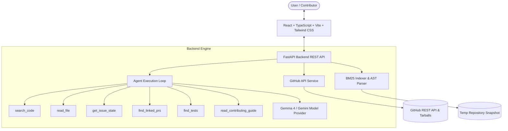
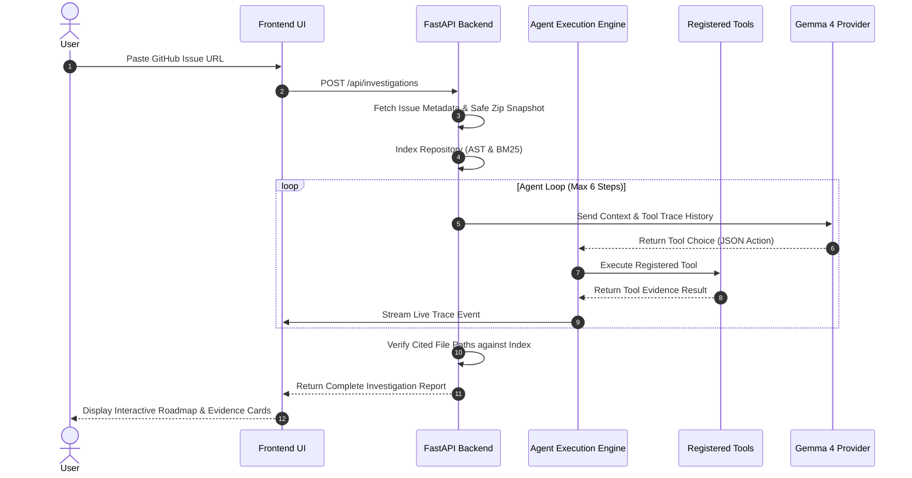

# RepoXray

> **Investigate smarter. Contribute confidently.**

RepoXray is an open-source, evidence-driven AI agent designed to help developers, first-time open-source contributors, and Hacktoberfest participants understand public GitHub issues before writing code.

---

## 📌 Problem Statement

When developers discover a GitHub issue in an unfamiliar open-source codebase, they often face significant friction:
- Which source files and functions are relevant to the issue?
- Which unit tests cover the affected functionality?
- Has someone already submitted a Pull Request or been assigned to this issue?
- What test command should be run locally?

Generic AI chatbots often invent non-existent file paths, hallucinate test commands, or provide unsupported recommendations. 

RepoXray solves this by executing real repository searches, AST symbol extraction, BM25 text retrieval, and registered tool interactions to produce a **traceable, evidence-verified investigation report**.

---

## ⚡ Key Features

1. **🤖 Gemma 4 AI Issue Investigator**
   - An autonomous agent loop using registered investigative tools (`search_code`, `read_file`, `get_issue_state`, `find_linked_prs`, `find_tests`, `read_contributing_guide`).
   - Strict execution bounds (max 6 steps, timeouts, tool verification, fallback handling).

2. **🔍 Evidence-Based Code and Test Finder**
   - BM25 text retrieval over indexed repository files with normalized `snake_case` and `camelCase` identifiers.
   - Python AST analysis extracting `def`, `async def`, and `class` definitions.
   - Categorized evidence badges: `VERIFIED FACT`, `HEURISTIC MATCH`, `AI INFERENCE`.
   - Direct GitHub file permalinks at the precise commit SHA.

3. **🛣️ Contribution Roadmap & Conflict Checker**
   - Conflict detection: checks for closed issues, assigned contributors, and cross-referenced PRs.
   - Actionable step-by-step roadmap with interactive checkboxes to track contribution progress.
   - Extracted documented test commands directly from `CONTRIBUTING.md` or `README.md`.

4. **📡 Live Agent Trace Activity Panel**
   - Real-time step-by-step progress viewer showing tool names, execution duration, input arguments, and concise results.

---

## 🏗️ Architecture Overview



### Agent Tool-Calling Workflow



---

## 🛠️ Technology Stack

### Frontend
- **Framework**: React 18 + TypeScript + Vite
- **Styling**: Vanilla Tailwind CSS (Deep Navy/Indigo Dark Theme with Glassmorphism)
- **Icons**: Lucide React
- **HTTP Client**: Axios

### Backend
- **Framework**: Python 3.11+ / FastAPI / Uvicorn
- **Validation**: Pydantic v2
- **HTTP Client**: `httpx`
- **Retrieval Engine**: BM25 (`rank-bm25`) + Python `ast` module
- **AI Model Integration**: Configurable Gemma 4 / Gemini model provider with fallback evidence loop
- **Testing**: `pytest` & `pytest-asyncio`

---

## 🚀 Quick Start & Local Installation

### Prerequisites
- **Python**: 3.11 or later
- **Node.js**: v18.0 or later (with `npm`)
- **Git**

---

### Step 1: Set Up Backend

Open PowerShell or terminal in the project root:

```powershell
# Navigate to backend directory
cd backend

# Create a virtual environment
python -m venv venv

# Activate the virtual environment
# On Windows PowerShell:
.\venv\Scripts\Activate.ps1
# On macOS/Linux:
# source venv/bin/activate

# Install dependencies
pip install -r requirements.txt

# Run backend automated unit tests
pytest

# Start the FastAPI backend server
uvicorn app.main:app --reload --port 8000
```

The backend server will run at `http://127.0.0.1:8000`. API docs are available at `http://127.0.0.1:8000/docs`.

---

### Step 2: Set Up Frontend

In a second terminal window:

```powershell
# Navigate to frontend directory
cd frontend

# Install dependencies
npm install

# Start Vite dev server
npm run dev
```

Open your browser at `http://localhost:5173`.

---

## ⚙️ Environment Variables Configuration

### Backend Configuration (`backend/.env`)

Copy `backend/.env.example` to `backend/.env`:

| Variable | Required | Default | Description |
|---|---|---|---|
| `GITHUB_TOKEN` | Optional | `""` | GitHub Personal Access Token to avoid API rate limits on public repositories |
| `GEMMA_PROVIDER` | Optional | `"google"` | AI Model provider (`google` or custom base URL) |
| `GEMMA_API_KEY` | Optional | `""` | Google AI Studio / Gemini API key for Gemma model access |
| `GEMMA_MODEL` | Optional | `"gemma-4b"` | Model identifier |
| `GEMMA_API_BASE_URL` | Optional | `""` | Custom API base URL if using OpenAI-compatible proxy |
| `MAX_AGENT_STEPS` | Optional | `6` | Maximum tool execution step limit per investigation |
| `FRONTEND_ORIGIN` | Optional | `"http://localhost:5173"` | Allowed CORS origin |

> **Note**: If `GEMMA_API_KEY` is not provided, RepoXray seamlessly operates in **Heuristic Evidence Mode**, using deterministic BM25 search, AST parsing, and test discovery without breaking.

---

## 🔌 API Endpoint Documentation

| Method | Endpoint | Description |
|---|---|---|
| `GET` | `/api/health` | Service health status and configuration check |
| `GET` | `/api/model/status` | Gemma 4 model provider connection status |
| `POST` | `/api/investigations` | Submit issue URL and start asynchronous investigation |
| `GET` | `/api/investigations/{id}` | Get current investigation status & progress % |
| `GET` | `/api/investigations/{id}/trace` | Retrieve real-time agent execution trace |
| `GET` | `/api/investigations/{id}/report` | Fetch completed verified investigation report |
| `POST` | `/api/investigations/{id}/cancel` | Safely cancel a running investigation |

---

## 🔒 Security Considerations

- **Input Sanitization**: Strictly validates input URLs. Rejects non-GitHub domains and Pull Request URLs.
- **Zip Slip & Path Traversal Protection**: Archive extraction validates that all target file paths remain within a temporary sandboxed directory.
- **Path Escape Prevention**: `read_file` tool rejects paths escaping the repository root directory (`..` checks).
- **Execution Safety**: RepoXray **never** executes code from cloned repositories.
- **Secret Redaction**: API keys and tokens are stripped from logs and agent traces.

---

## ⚠️ Known Limitations

- **Language Support**: Optimized for Python repositories in MVP. Other languages are text-indexed via BM25 without AST symbol breakdown.
- **Repository Size Limits**: Large repositories (>1500 files or individual files >500KB) are truncated for responsiveness.

---

## 🧪 Running Automated Tests

To run all backend unit & integration tests:

```powershell
cd backend
pytest -v
```

To test frontend production build:

```powershell
cd frontend
npm run build
```

---

## 📄 License

This project is open-source software licensed under the [MIT License](LICENSE).
# repoxray

